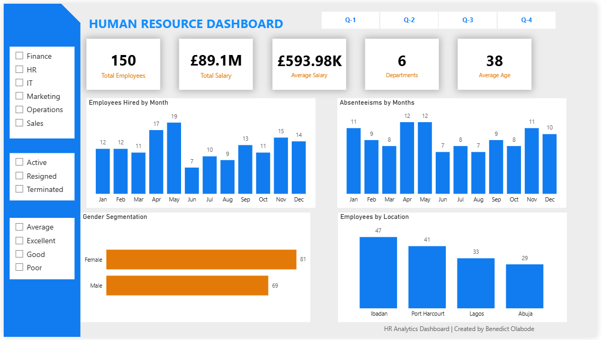

# PowerBI-HR-Analytics-Dashboard
Interactive HR analytics dashboard built in Power BI to analyse workforce trends, employee performance, absenteeism, and salary insights
# 📊 HR Analytics Dashboard – Power BI

## 📌 Overview
This project is an interactive HR Analytics Dashboard built using Power BI to analyse workforce data and generate meaningful business insights.  

The dashboard helps monitor employee trends, salary distribution, absenteeism, gender segmentation, and departmental performance through interactive visualisations and KPIs.

---

## 🛠️ Tools & Technologies Used

- Power BI
- Power Query
- DAX
- Data Modelling
- Excel

---

## 📈 Dashboard Features

The dashboard includes:

- Total employee overview
- Salary analysis
- Average employee age
- Department breakdown
- Monthly hiring trends
- Absenteeism analysis
- Gender segmentation
- Employee distribution by location
- Interactive slicers and filters

---

## 💡 Key Business Insights

Through this analysis, several insights were identified:

- Certain departments contain a larger share of employees
- Employee absenteeism varies across months
- Workforce distribution differs significantly by location
- Gender representation is relatively balanced
- HR data can be used to support workforce planning and decision-making

---

## 📷 Dashboard Preview



---

## 📁 Project Structure

``` id="vzhk6y"
HR-Analytics-Dashboard/
│
├── HR_Dashboard.pbix
├── dashboard_screenshot.png
├── dataset.xlsx
└── README.md
